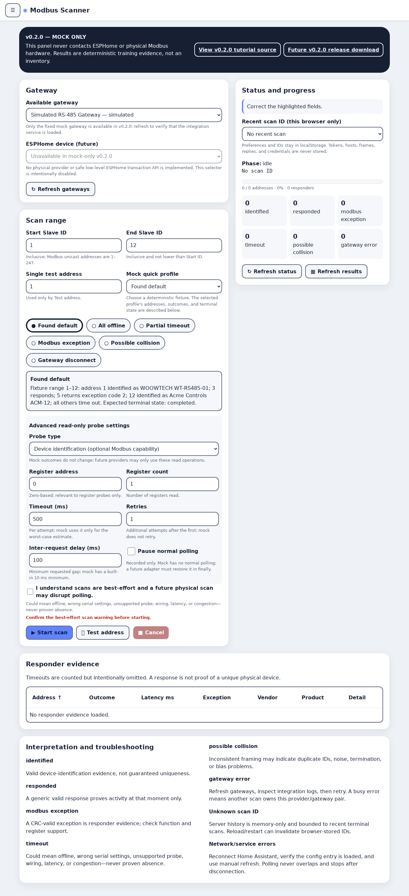

# Woow ESPHome Modbus Scanner

A HACS-compatible Home Assistant custom integration for safe, provider-backed,
best-effort Modbus address discovery. Version **0.2.0** is intentionally
hardware-free: it ships only a deterministic `MockGatewayProvider` and never
opens an ESPHome connection or a Modbus transport.

繁體中文：[README_zh-TW.md](README_zh-TW.md)

## Downloadable Traditional-Chinese tutorial

**[View the v0.2.0 tutorial source](https://github.com/WOOWTECH/Woow_ha_esphome_modbus_scanner/blob/main/docs/tutorial/woow-esphome-modbus-scanner-v0.2.0-zh-TW.html)** · **[Future v0.2.0 tutorial release asset](https://github.com/WOOWTECH/Woow_ha_esphome_modbus_scanner/releases/download/v0.2.0/woow-esphome-modbus-scanner-v0.2.0-zh-TW.html)** · **[Raw v0.2.0 HTML](https://raw.githubusercontent.com/WOOWTECH/Woow_ha_esphome_modbus_scanner/main/docs/tutorial/woow-esphome-modbus-scanner-v0.2.0-zh-TW.html)** · **[Source-file view for v0.1.0](https://github.com/WOOWTECH/Woow_ha_esphome_modbus_scanner/blob/main/docs/tutorial/woow-esphome-modbus-scanner-v0.1.0-zh-TW.html)** · **[Download the v0.1.0 tutorial HTML release asset](https://github.com/WOOWTECH/Woow_ha_esphome_modbus_scanner/releases/download/v0.1.0/woow-esphome-modbus-scanner-v0.1.0-zh-TW.html)** · **[Raw v0.1.0 HTML](https://raw.githubusercontent.com/WOOWTECH/Woow_ha_esphome_modbus_scanner/main/docs/tutorial/woow-esphome-modbus-scanner-v0.1.0-zh-TW.html)** · **[Download the v0.1.0 source archive](https://github.com/WOOWTECH/Woow_ha_esphome_modbus_scanner/archive/refs/tags/v0.1.0.zip)**

> **v0.2.0 MOCK ONLY:** the HTML is offline tutorial documentation, not ESPHome
> firmware. This release does not connect to ESPHome or scan physical hardware.

## Status and safety

This release is useful for automations, service-client development, lifecycle
testing, and evaluating result semantics without hardware. It is **not** a real
bus scanner yet.

Discovery is read-only and best-effort. A timeout does not prove an address is
unused. A response does not prove a Slave ID uniquely identifies one physical
device. Noise and duplicate IDs can look like a possible collision. A future
physical scan may disrupt normal polling even when all probes are read-only.

`start_scan` therefore accepts only the literal JSON/YAML boolean
`safety_confirmed: true`; truthy numbers and strings are rejected.

**Permanent all-user policy:** all six scanner services and the sidebar are
available to every authenticated Home Assistant user; there is deliberately no
admin/user permission gate. This makes the mock workbench convenient, but it is
an explicit future physical-provider risk: any HA user could generate bus
traffic, disrupt normal polling, or expose responder evidence. Installers must
control HA accounts and must reassess this policy before enabling real hardware.

## Installation

### HACS custom repository

1. In HACS, add this repository as an **Integration** custom repository.
2. Install **Woow ESPHome Modbus Scanner**.
3. Restart Home Assistant.
4. Go to **Settings → Devices & services → Add integration** and add it once.
5. Open **Modbus Scanner** (`mdi:radar`) in the sidebar. It is visible to all HA users.

### Manual

Copy `custom_components/woow_esphome_modbus_scanner` into your Home Assistant
`custom_components` directory, restart, then add the integration. The config
flow is singleton: a second entry is rejected.

## Sidebar scan workbench

Mocked browser validation preview (not a hardware claim):

[](docs/screenshots/)

The standalone route is `/woow-esphome-modbus-scanner`. Refresh the gateway
catalog, choose one of six mock quick profiles, set the inclusive 1–247 range,
and acknowledge the best-effort warning. Advanced controls expose probe type,
register address/count, timeout, retries, delay, and the future polling flag
with their service bounds. The ESPHome selector is visibly disabled because no
physical provider exists.

**Start scan** begins a job, then the panel performs non-overlapping one-second
status polls and automatically fetches terminal results. **Cancel**, **Test
address**, **Refresh status**, and **Refresh results** map directly to their six
public services. Progress, all six outcome counts, terminal errors, and a
sortable responder-evidence table are shown locally. Preferences, disclosure
state, and recent scan IDs are stored only in browser `localStorage`; tokens,
hosts, frames, credentials, and service replies are never stored. Recent IDs
can become unknown after integration reload/restart because server history is
bounded and memory-only. See the linked HTML tutorial for outcomes and
troubleshooting.

## Public services

The domain is `woow_esphome_modbus_scanner`. The complete and only public
service set is:

- `list_gateways`
- `start_scan`
- `get_scan_status`
- `get_scan_results`
- `cancel_scan`
- `test_address`

Example mock scan:

```yaml
service: woow_esphome_modbus_scanner.start_scan
data:
  provider: mock
  gateway_id: mock:rs485-gateway
  start_id: 1
  end_id: 12
  probe_type: device_identification
  timeout_ms: 500
  retries: 1
  inter_request_delay_ms: 0
  mock_profile: found_default
  safety_confirmed: true
response_variable: started
```

Use the returned `scan_id` with `get_scan_status` and `get_scan_results`.
`test_address` uses the same coordinator but constrains work to one address.
Only one scan may own a provider/gateway pair at a time. Terminal history is
bounded in memory (20 scans by default) and is not persisted across reloads.

The service UI includes an optional `esphome_device_id` device selector filtered
to Home Assistant's ESPHome integration. It is reserved for a future adapter;
0.2.0 accepts it for forward-compatible service forms but mock behavior is
unchanged and no selected device is contacted.

## Deterministic mock profiles

- `found_default`
- `all_offline`
- `partial_timeout`
- `modbus_exception`
- `possible_collision`
- `gateway_disconnect`

Results normalize identity replies, generic replies, protocol exceptions,
timeouts, possible collisions, and gateway failures. Timeout details are counted
but not retained as responder records, keeping result memory bounded by actual
non-timeout outcomes.

## Future ESPHome adapter contract

No ESPHome adapter is included in 0.2.0. A future provider must implement the
`GatewayProvider` protocol documented in
[`docs/design/provider-contract.md`](docs/design/provider-contract.md): advertise
provider-owned gateways synchronously and run one validated request
asynchronously, emitting normalized `ProbeResult` objects incrementally while
honoring cooperative cancellation. It must map the selected Home Assistant
device to an explicit gateway, use only read probes, serialize access per
gateway, restore paused polling in `finally`, and translate transport loss to
`GatewayProviderError`. The coordinator deliberately owns validation, lifecycle,
history, and response shapes; the adapter must not bypass those controls.

An ESPHome device selector is not evidence that Home Assistant or ESPHome expose
the low-level serial transaction API needed for this contract. Feasibility and
an upstream API must be established before a real provider can be claimed.

## Development

The hermetic suite exercises models, mock behavior, coordinator adversarial
boundaries, all-user service policy, singleton config flow, panel registration,
frontend model/source/bundle drift, browser behavior, and unload races.
`pytest --collect-only -q` is the source of truth and currently collects **131 Python
tests**; the frontend adds **7 Node unit tests** plus panel/tutorial
Playwright scenario checks.
Live smoke testing is opt-in and mock-only.

```bash
uv venv --python 3.13.2
uv pip install -r requirements-test.txt
.venv/bin/ruff check .
.venv/bin/pytest --collect-only -q
.venv/bin/pytest --cov=custom_components/woow_esphome_modbus_scanner \
  --cov-report=term-missing --cov-fail-under=90
.venv/bin/python -m compileall -q custom_components tests/live
cd panel_frontend && npm ci --include=dev && npm test && npm run check:drift
npx playwright install chromium && npm run test:browser
```

See [`tests/live/README.md`](tests/live/README.md) for the external Home
Assistant mock-service smoke script. No deployment, release, or hardware test is
part of the hermetic commands.

## License

MIT — see [LICENSE](LICENSE).
